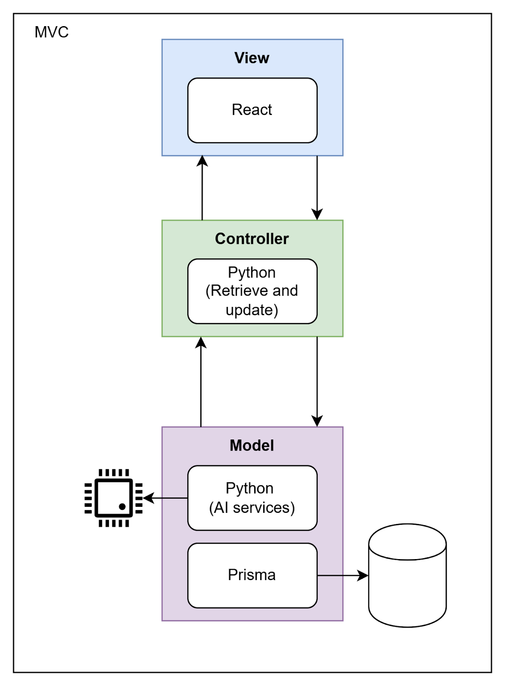
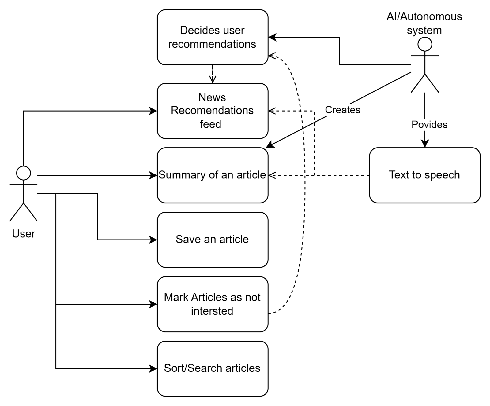

# News-AI Design Documentation

## Team Information

* Team name: Group 3
* Team members
  * Daniel Arcega
  * AJ Barea
  * Daniel Corcoran
  * Ivan Rojas

## Executive Summary

News-AI is an AI-powered news aggregation platform that provides personalized content recommendations and article summaries. Key features include content personalization, AI summarization, and text-to-speech capabilities. The system combines multiple news sources with machine learning to help users efficiently consume relevant news content.

## Requirements

### Definition of MVP

The Minimum Viable Product will deliver a working news aggregation platform with basic AI-powered features including article summarization and simple content recommendations.

### MVP Features

1. News Article Management
   * Fetch articles from major news APIs
   * Store and index articles for quick retrieval
   * Basic article categorization

2. AI Features
   * Article summarization using AI models
   * Basic content recommendation system
   * Text-to-speech for article content

3. User Interface
   * Article feed browsing
   * Summary view and full article view
   * Basic user preferences management

## Architecture and Design

### Software Architecture

The architecture diagram illustrates the three-tier structure of the News-AI system, showing how data flows between components:

1. The frontend tier handles user interactions through React components
2. The backend API layer processes requests and manages business logic
3. The data tier includes both the news article database and AI services
4. External services such as news APIs and AI models are integrated via secure connections

Key interactions and data flows are represented by arrows, demonstrating how user requests are processed through the system layers.

### Use Cases

This use case diagram depicts the primary actors and their interactions with News-AI:

1. Users can:
   * Browse news articles
   * Request AI-generated summaries
   * Use text-to-speech features
   * Customize their content preferences

2. The System handles:
   * Content aggregation from news sources
   * AI-powered article summarization
   * Personalized recommendations
   * User preference management
